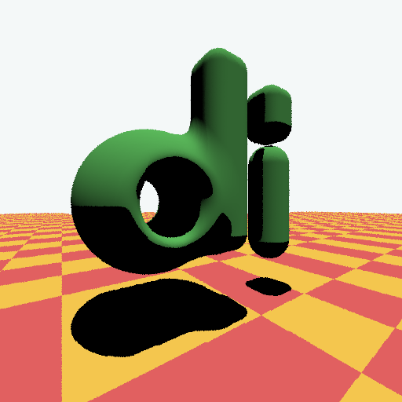

# My business card sized ray tracer

Dead simple signed distance function ray marcher written in as few characters of
code as possible. Clearly, the rendered image is not that cool, but it was fun.



Somewhat minimized source code (2270 characters)

```c++
#include<stdio.h>
#include<math.h>
using I=int;using D=double;D eps=.01;struct V{D x,y,z;V():V(0){} V(D
v){x=y=z=v;}V(D a,D b,D c){x=a;y=b;z=c;}D len(){return sqrt(x*x+y*y+z*z);}V
operator+(V o){return V(x+o.x,y+o.y,z+o.z);}V operator-(V o){return
V(x-o.x,y-o.y,z-o.z);}V operator/(V o){return V(x/o.x,y/o.y,z/o.z);}V
operator*(D s){return V(x*s,y*s,z*s);}V operator*(V o){return
V(y*o.z-z*o.y,z*o.x-x*o.z,x*o.y-y*o.x);}D dot(V o){return x*o.x+y*o.y+z*o.z;}V
operator!(){return*this/V(len());}};D clamp(D v,D l,D h){return
fmin(h,fmax(l,v));}D mix(D l,D h,D t){return(1-t)*l+t*h;}D rand1(){return
D(rand())/RAND_MAX;}D uni(D d1,D d2,D k){D h=clamp(.5+.5*(d2-d1)/k,0,1);return
mix(d2,d1,h)-k*h*(1-h);}D dif(D d2,D d1,D k){D
h=clamp(.5-.5*(d2+d1)/k,0,1);return mix(d2,-d1,h)+k*h*(1-h);}D sds(V p,D
r){return p.len()-r;}D sddl(V p,D r){p.z=0;return p.len()-r;}D sdvl(V p,D r,D
h){p.y-=clamp(p.y,0,h);return p.len()-r;}D sdbox(V p,V b,D r){V
q(fmax(fabs(p.x)-b.x,0),fmax(fabs(p.y)-b.y,0),fmax(fabs(p.z)-b.z,0));return
q.len()-r;}D sdf(V p,V& c){D dd=dif(sds(p,.45),sddl(p,.2),.1);dd=uni(dd,sdbox(p-
V(.33,-.3,.3),V(.05,.5,.05),.1),.15);D ad=sdbox(p-V(.9,-.7,.25),V(.05,.1,.05),.1
);ad=fmin(ad,sdvl(p-V(.9,-.3,.25),.15,.6));D td=fmin(dd,ad);p=p-V(0,.7,0);D
pd=p.dot(!V(0,-1,0));if(td<pd){c=V(.13,.54,.13);return td;}auto f=[](D v){return
fabs(fmod(v,1))>.5;};c=(f(p.x)^ f(p.z))?V(.82,.15,.15):V(.96,.63,.1);return
pd;}V march(V e,V rd,I l,I& h){V c;V l1=!V(0,-1,.3);for(I i=0;i<100;++i){D
d=sdf(e,c);if(d<eps){V cc;V
n=!V(sdf(V(e.x+eps,e.y,e.z),cc)-sdf(V(e.x-eps,e.y,e.z),cc),
sdf(V(e.x,e.y+eps,e.z),cc)-sdf(V(e.x,e.y-eps,e.z),cc),
sdf(V(e.x,e.y,e.z+eps),cc)-sdf(V(e.x,e.y,e.z-eps),cc));h=1;I
hh=0;if(l)march(e+n*eps,n,0,hh);return hh?V():c*n.dot(l1);}e=e+rd*d;}h=0;return
V(.92,.95,.95);}I main(){I w=512,h=w;I samples=10;V look_at(.4,0,0);V
eye(-.5,0,1.3);V zd=!(look_at-eye);V xd=!(zd*V(0,1,0));V yd=!(zd*xd);auto d=new
char[w*h*3];for(I y=0;y<h;++y){for(I x=0;x<w;++x){V c;for(I s=0;s<samples;++s){D
xt=D(x+rand1())/w*2-1;D yt=D(h-y+rand1())/h*2-1;V rd=!((xd*xt)+(yd*yt)+zd);I
h;c=c+march(eye,rd,1,h);}c=c/V(samples);auto
p=d+y*w*3+x*3;p[0]=sqrt(c.x)*255;p[1]=sqrt(c.y)*255;p[2]=sqrt(c.z)*255;}}
printf("P6 %d %d 255\n",w,h);fwrite(d,1,w*h*3,stdout);delete[] d;return 0;}
```
